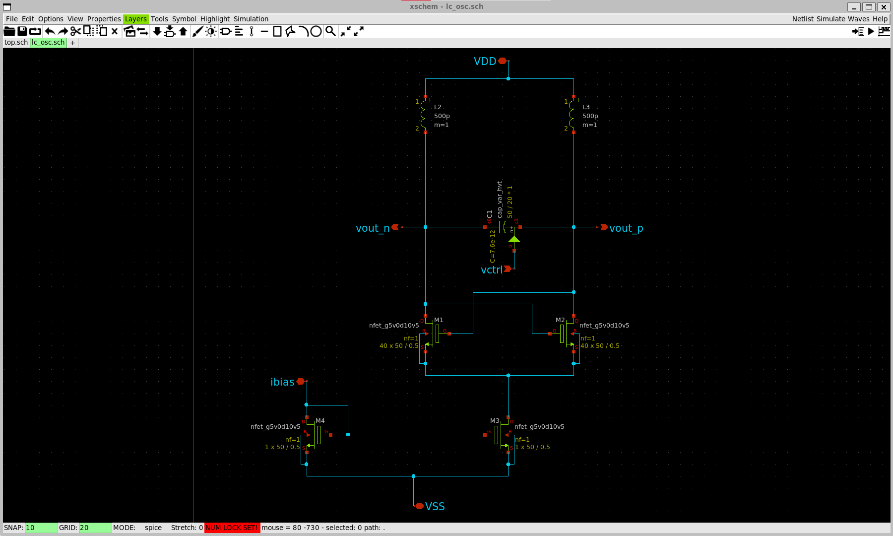
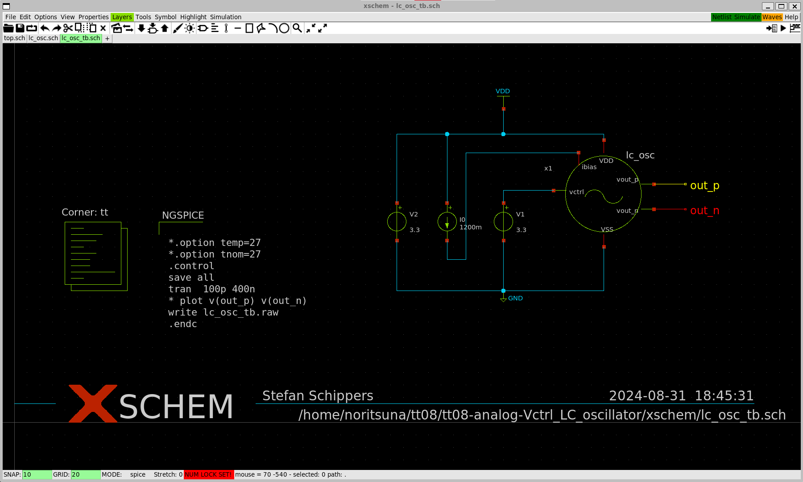
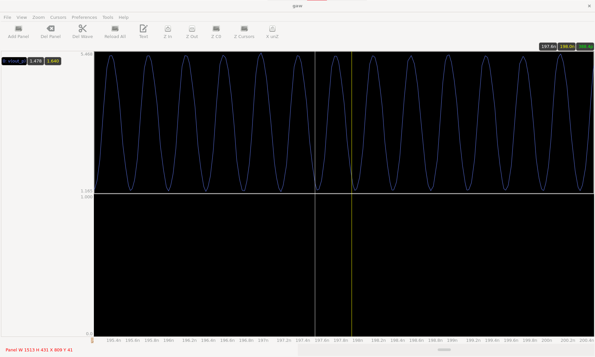
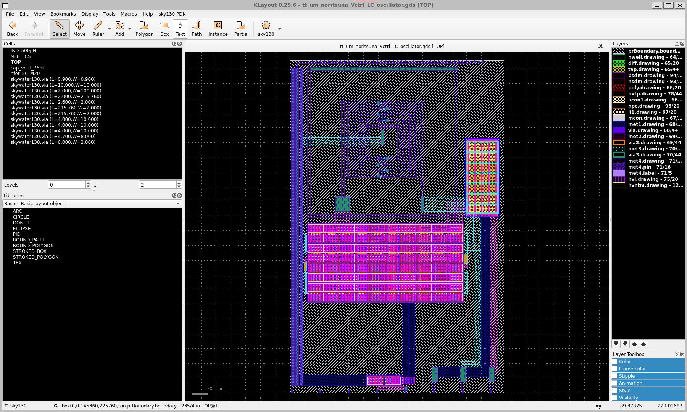
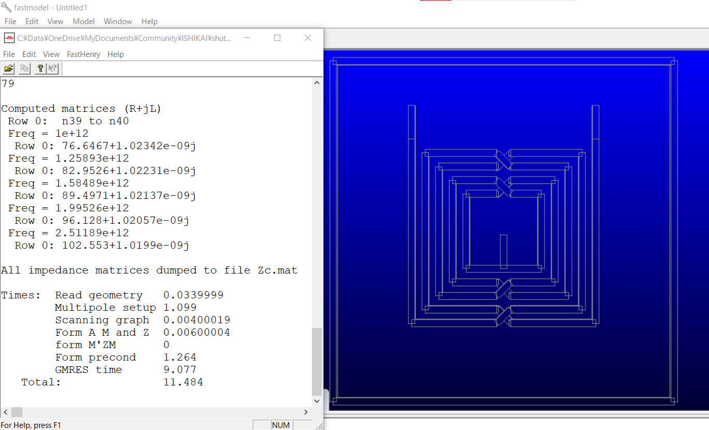
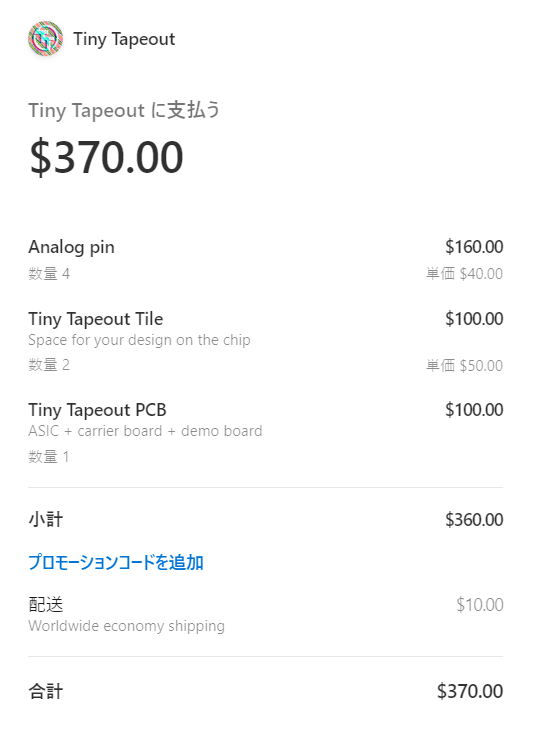
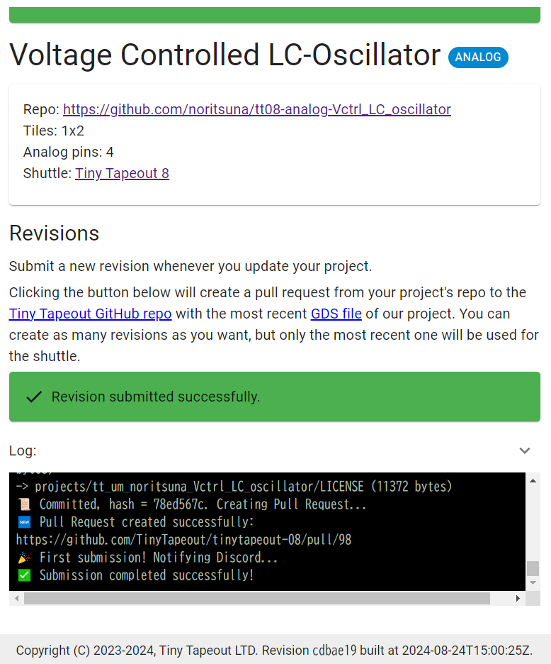

 
# Voltage Controlled LC-Oscillator
This project is "Voltage Controlled LC-Oscillator of 2GHz for Skywater130nm".

## Circuit

## Test Bench

### Result
- 388pSec = 2.6GHz 

## Layout

### Inductor
Inductor simulations were executed on [fasthenry2](https://www.fastfieldsolvers.com/fasthenry2.htm).  
- 

## Tapeout
This project made by [Tiny Tapeout](https://tinytapeout.com/).

### Price
- Analog Space: 1x2 = $100
- Analog Pin: 4pin = $40 * 4 = $160
- PCB board(Debug Board) = $100
- Shipping Fee = $10
  - Total = $370

### Submit Result

